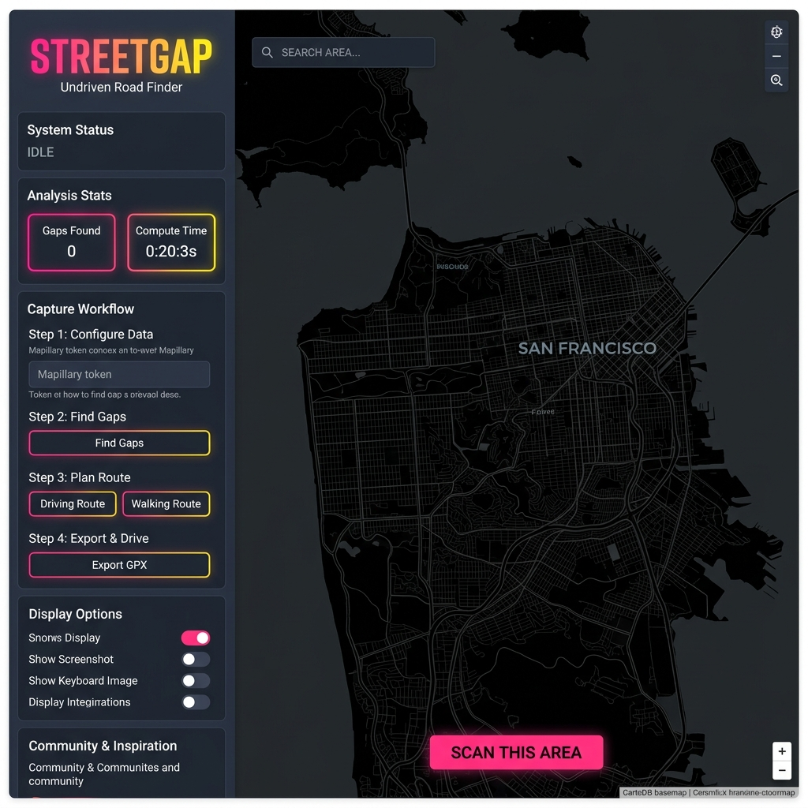
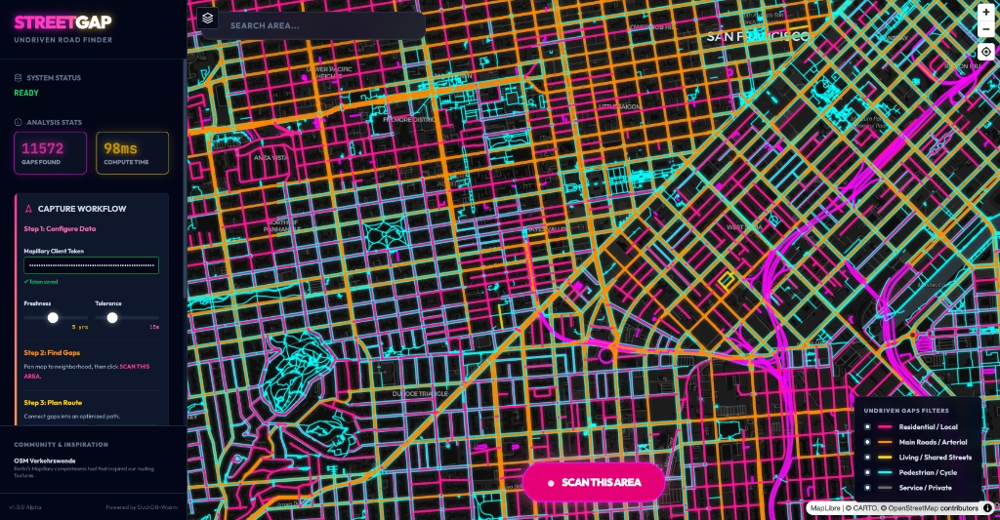
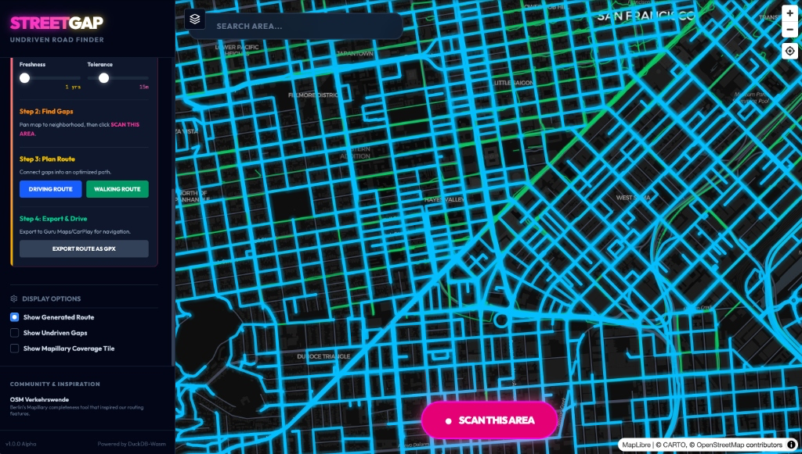
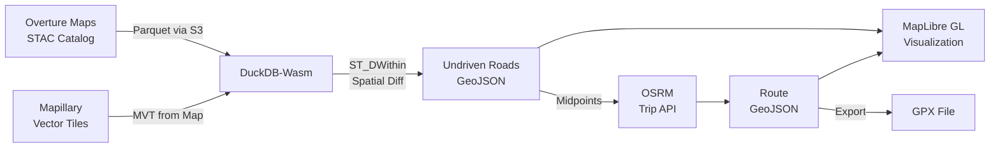

<p align="center">
  
</p>

<h1 align="center">🛣️ StreetGap Web</h1>

<p align="center">
  <strong>Find streets without Mapillary coverage. Plan a route. Close the gap.</strong>
</p>

<p align="center">
  <a href="https://streetgap-web.web.app">Live Demo</a> ·
  <a href="#features">Features</a> ·
  <a href="#getting-started">Getting Started</a> ·
  <a href="#architecture">Architecture</a> ·
  <a href="https://github.com/Loprz/streetgap-web/issues">Report Bug</a>
</p>

<p align="center">
  
  
  
  
</p>

---

## What is StreetGap?

**StreetGap** is a web-based tool that identifies roads with no recent [Mapillary](https://www.mapillary.com/) street-level imagery and helps you plan an optimized driving or walking route to capture them.

It cross-references **Overture Maps Foundation** road data with **Mapillary** coverage tiles — all computed **client-side** using [DuckDB-Wasm](https://duckdb.org/docs/api/wasm/overview) — to surface the streets that need fresh imagery. Then it generates an optimized route through those gaps via [OSRM](https://project-osrm.org/), and lets you export it as GPX for navigation apps like Guru Maps or CarPlay.

> **Zero backend required.** All geospatial analysis runs in your browser.

---

## Screenshots

### 🗺️ Initial View — Dark Map Interface
<p align="center">
  
</p>

The app launches with a dark CartoDB basemap, a collapsible sidebar with a step-by-step capture workflow, and the prominent **SCAN THIS AREA** button. Configure your Mapillary token and freshness window, then scan any neighborhood.

### 📊 Gap Analysis — Color-Coded Undriven Roads
<p align="center">
  
</p>

After scanning, undriven roads are rendered in vibrant color-coded segments by road type:
- 🟣 **Deep Pink** — Residential / Local streets (prime Mapillary targets)
- 🟠 **Orange** — Main roads / Arterials
- 🟡 **Gold** — Living / Shared streets
- 🔵 **Cyan** — Pedestrian / Cycle paths
- ⚫ **Gray** — Service / Private roads

Green lines show existing Mapillary coverage. Toggle individual road types on/off with the legend filters.

### 🧭 Route Generation — Optimized Capture Path
<p align="center">
  
</p>

Generate a driving or walking route that efficiently connects all undriven road segments. The cyan route line shows the OSRM-optimized path weaving through every gap. Use the Display Options toggles to isolate the route, undriven gaps, or Mapillary coverage. Export as GPX and load into your favorite navigation app.

---

## Features

| Feature | Description |
|---------|-------------|
| **🔍 Gap Detection** | Cross-references Overture Maps road data with Mapillary coverage to find streets without recent imagery |
| **⏱ Freshness Filter** | Configurable lookback window (1–10 years) to define what counts as "stale" coverage |
| **🎨 Road Classification** | Color-coded visualization by road type (residential, arterial, pedestrian, service, etc.) |
| **🧭 Route Planning** | One-click driving or walking route generation through all undriven segments using OSRM |
| **📦 GPX Export** | Export optimized routes as GPX files for Guru Maps, CarPlay, or any GPX-compatible app |
| **🔎 Location Search** | Geocoding-powered search (via [Photon/Komoot](https://photon.komoot.io/)) to jump to any neighborhood |
| **📡 Vector Tiles** | Live Mapillary MVT layer for instant visual feedback on existing coverage |
| **🦆 Client-Side SQL** | All geospatial analysis runs in-browser via DuckDB-Wasm — no server needed |
| **🌐 Overture Maps** | Dynamically fetches road network data from the latest Overture Maps STAC catalog |

---

## Getting Started

### Prerequisites

- **Node.js** ≥ 18
- A **Mapillary Client Token** — [Get one here](https://www.mapillary.com/dashboard/developers)

### Installation

```bash
# Clone the repository
git clone https://github.com/Loprz/streetgap-web.git
cd streetgap-web

# Install dependencies
npm install

# Start the development server
npm run dev
```

The app will be available at `http://localhost:3000`.

### Configuration

1. Open the app in your browser
2. In the sidebar under **Step 1: Configure Data**, paste your Mapillary Client Token (`MLY|...`)
3. The token is saved to `localStorage` and persists across sessions

### Usage Workflow

1. **🔎 Search** — Use the search bar to navigate to your target neighborhood
2. **⚙️ Configure** — Set the freshness window and tolerance radius in the sidebar
3. **🔴 Scan** — Click **SCAN THIS AREA** to analyze the visible map area
4. **📊 Review** — Examine the color-coded undriven gaps on the map
5. **🧭 Route** — Click **Driving Route** or **Walking Route** to generate an optimized path
6. **📦 Export** — Click **Export Route as GPX** to download the route file

---

## Architecture

```
streetgap-web/
├── App.tsx                      # Main app shell with sidebar UI
├── index.html                   # Entry point with import maps
├── index.tsx                    # React DOM mount
├── index.css                    # Global styles
├── types.ts                     # TypeScript interfaces & enums
├── components/
│   ├── StreetGapMap.tsx          # MapLibre GL map with all layers
│   └── SearchControl.tsx        # Geocoding search bar (Photon API)
├── services/
│   ├── db.ts                    # DuckDB-Wasm singleton (spatial + httpfs)
│   ├── overture.ts              # Overture Maps STAC → Parquet road fetcher
│   ├── mapillary.ts             # Mapillary coverage → DuckDB ingestion
│   ├── analysis.ts              # Spatial difference query orchestrator
│   └── routing.ts               # OSRM multi-chunk trip stitching
├── utils/
│   └── export.ts                # GeoJSON → GPX converter
├── vite.config.ts               # Vite config with OSRM proxy
├── firebase.json                # Firebase Hosting config
└── .github/workflows/
    └── firebase-deploy.yml      # CI/CD: auto-deploy on push to main
```

### Data Pipeline



### Tech Stack

| Layer | Technology |
|-------|-----------|
| **Frontend** | React 18, TypeScript |
| **Bundler** | Vite 6 |
| **Styling** | Tailwind CSS 4 |
| **Map** | MapLibre GL JS |
| **Spatial DB** | DuckDB-Wasm (with `spatial` + `httpfs` extensions) |
| **Road Data** | Overture Maps Foundation (via STAC + Parquet) |
| **Coverage** | Mapillary Vector Tiles (MVT) |
| **Routing** | OSRM (Open Source Routing Machine) |
| **Geocoding** | Photon (Komoot) |
| **Hosting** | Firebase Hosting |
| **CI/CD** | GitHub Actions |

---

## Deployment

### Firebase Hosting (Production)

The app auto-deploys to [Firebase Hosting](https://streetgap-web.web.app) on every push to `main` via GitHub Actions.

```bash
# Manual deploy
npm run build
firebase deploy
```

### Build for Production

```bash
npm run build    # Output → dist/
npm run preview  # Preview the production build locally
```

---

## How It Works

### 1. Road Network Ingestion
The app queries the [Overture Maps STAC catalog](https://docs.overturemaps.org/) to dynamically discover the latest road segment release. It fetches only the Parquet partitions whose bounding boxes overlap the current map view, then loads them into DuckDB-Wasm filtered to `subtype = 'road'`.

### 2. Coverage Detection
When you click **SCAN THIS AREA**, the app extracts Mapillary sequence geometries directly from the rendered vector tiles in MapLibre GL using `querySourceFeatures()`. These are filtered by the configured freshness window (`captured_at >= cutoff`) and bulk-inserted into DuckDB.

### 3. Spatial Analysis
A `NOT EXISTS` + `ST_DWithin` SQL query in DuckDB identifies road segments that have **no** Mapillary coverage geometry within the configured buffer radius (default 15m). The results are classified by Overture road `class` and rendered as color-coded GeoJSON.

### 4. Route Optimization
Undriven road midpoints are sorted via **Nearest-Neighbor** heuristic (starting from the geographic centroid) and split into chunks of 25. Each chunk is routed via OSRM's `/trip/` endpoint, and consecutive chunks are stitched together with `/route/` connector calls.

### 5. GPX Export
The final route geometry is converted to GPX 1.1 XML and downloaded as a file, ready for import into navigation apps.

---

## Community & Inspiration

- [**OSM Verkehrswende**](https://www.osm-verkehrswende.org/mapillary/posts/2025-10-12-mapillary-completeness-map/) — Berlin's Mapillary completeness tool that inspired StreetGap's routing features
- [**Mapillary**](https://www.mapillary.com/) — The street-level imagery platform that makes this all possible
- [**Overture Maps Foundation**](https://overturemaps.org/) — Open map data used for the road network

---

## Contributing

Contributions are welcome! Please feel free to submit a Pull Request.

1. Fork the repository
2. Create your feature branch (`git checkout -b feature/amazing-feature`)
3. Commit your changes (`git commit -m 'Add amazing feature'`)
4. Push to the branch (`git push origin feature/amazing-feature`)
5. Open a Pull Request

---

## License

This project is open source and available under the [MIT License](LICENSE).

---

<p align="center">
  <strong>Built with ❤️ for the Mapillary community</strong><br/>
  <sub>v1.0.0 Alpha · Powered by DuckDB-Wasm</sub>
</p>
